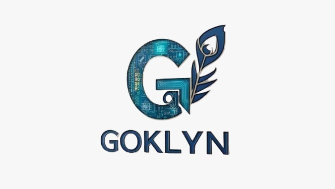

# GOKLYN Technologies - Quantum AI Website

A **world-class, futuristic, quantum-inspired AI website** built with the MERN stack. This is a premium, production-ready website featuring stunning animations, glassmorphism design, and cutting-edge technology.



## 🚀 Features

### Frontend
- **React 18** with Hooks and modern patterns
- **Three.js / React Three Fiber** for immersive 3D particle effects
- **Framer Motion** for fluid page transitions and micro-interactions
- **GSAP** for advanced scroll-based animations
- **Tailwind CSS** for utility-first styling
- **Mobile-first responsive design** that works on all devices

### Backend
- **Express.js** REST API server
- **MongoDB / Mongoose** for data persistence
- **Secure architecture** with Helmet, CORS, and rate limiting
- **Form validation** with express-validator
- **Ready for deployment** on Vercel, Render, or AWS

### Design
- **Quantum/AI Theme** with neon accents (cyan, violet, electric blue)
- **Dark mode** as default
- **Glassmorphism** effects with backdrop blur
- **Neural network** visual patterns
- **Holographic** styling elements
- **Premium SaaS / Deep-tech** aesthetic

## 📁 Project Structure

```
goklyn/
├── public/
│   ├── goklyn-logo.png        # Logo asset
│   └── index.html             # HTML template with SEO
├── src/
│   ├── components/
│   │   ├── animations/        # Animation components
│   │   │   ├── GlowingLogo.jsx
│   │   │   ├── QuantumParticles.jsx
│   │   │   └── ScrollAnimations.jsx
│   │   ├── layout/            # Layout components
│   │   │   ├── Header.jsx
│   │   │   └── Footer.jsx
│   │   └── ui/                # Reusable UI components
│   │       ├── Button.jsx
│   │       ├── Card.jsx
│   │       └── Input.jsx
│   ├── pages/                 # Page components
│   │   ├── HomePage.jsx
│   │   ├── AboutPage.jsx
│   │   ├── ServicesPage.jsx
│   │   ├── TechnologyPage.jsx
│   │   ├── ProjectsPage.jsx
│   │   ├── ContactPage.jsx
│   │   └── CareersPage.jsx
│   ├── services/              # API services
│   │   └── api.js
│   ├── App.jsx                # Main app component
│   ├── index.js               # Entry point
│   └── index.css              # Global styles + Tailwind
├── server/
│   ├── models/                # MongoDB schemas
│   │   ├── Contact.js
│   │   ├── Inquiry.js
│   │   └── Newsletter.js
│   ├── routes/                # API routes
│   │   ├── contact.routes.js
│   │   ├── inquiry.routes.js
│   │   └── newsletter.routes.js
│   ├── server.js              # Express server
│   ├── package.json           # Backend dependencies
│   └── .env.example           # Environment variables
├── tailwind.config.js         # Tailwind configuration
├── postcss.config.js          # PostCSS configuration
└── package.json               # Frontend dependencies
```

## 🛠️ Installation

### Prerequisites
- Node.js 18+ 
- MongoDB (local or Atlas)
- npm or yarn

### Frontend Setup

```bash
# Navigate to project directory
cd goklyn

# Install frontend dependencies
npm install

# Start development server
npm start
```

The frontend will be available at `http://localhost:3000`

### Backend Setup

```bash
# Navigate to server directory
cd server

# Install backend dependencies
npm install

# Create environment file
cp .env.example .env

# Edit .env with your configuration
# MONGODB_URI=mongodb://localhost:27017/goklyn
# PORT=5000

# Start development server
npm run dev
```

The API will be available at `http://localhost:5000`

## 🎨 Design System

### Colors

| Color | Hex | Usage |
|-------|-----|-------|
| Quantum Cyan | `#00d4ff` | Primary accent |
| Neural Violet | `#a855f7` | Secondary accent |
| Electric Blue | `#3b82f6` | Tertiary accent |
| Dark Background | `#020617` | Main background |
| Dark Surface | `#0f172a` | Card backgrounds |

### Typography

- **Headings**: Outfit (700-900)
- **Body**: Inter (300-600)
- **Code**: JetBrains Mono

### Animations

- **Page Transitions**: Fade and slide with Framer Motion
- **Scroll Reveal**: Staggered fade-up animations
- **Hover Effects**: Scale, glow, and magnetic effects
- **3D Background**: Three.js quantum particles

## 🔌 API Endpoints

### Contact Form
- `POST /api/contact` - Submit contact form
- `GET /api/contact` - Get all contacts (admin)
- `PATCH /api/contact/:id/status` - Update status

### Inquiries
- `POST /api/inquiry` - Submit service inquiry
- `GET /api/inquiry` - Get all inquiries (admin)
- `PATCH /api/inquiry/:id` - Update inquiry

### Newsletter
- `POST /api/newsletter/subscribe` - Subscribe
- `POST /api/newsletter/unsubscribe` - Unsubscribe
- `GET /api/newsletter/subscribers` - Get subscribers (admin)

### Health
- `GET /api/health` - Server health check

## 📱 Responsive Design

The website is fully responsive with breakpoints:

- **Mobile**: < 640px
- **Tablet**: 640px - 1024px
- **Desktop**: > 1024px

Animations are optimized for mobile (lighter effects) and desktop (full effects).

## 🚀 Deployment

### Frontend (Vercel)

```bash
# Install Vercel CLI
npm i -g vercel

# Deploy
vercel
```

### Backend (Render)

1. Create a new Web Service on Render
2. Connect your GitHub repository
3. Set environment variables
4. Deploy

### Full Stack (Docker)

```dockerfile
# Dockerfile for production
FROM node:18-alpine
WORKDIR /app
COPY package*.json ./
RUN npm ci --only=production
COPY . .
RUN npm run build
EXPOSE 3000
CMD ["npm", "start"]
```

## 🧪 Quality Standards

- ✅ Clean, modular component architecture
- ✅ Reusable animation components
- ✅ Industry-standard folder structure
- ✅ TypeScript-ready (add @types packages)
- ✅ SEO optimized with meta tags
- ✅ Performance optimized with lazy loading
- ✅ Accessible design patterns

## 📝 Environment Variables

### Frontend (.env)
```env
REACT_APP_API_URL=http://localhost:5000/api
```

### Backend (.env)
```env
PORT=5000
NODE_ENV=development
MONGODB_URI=mongodb://localhost:27017/goklyn
CLIENT_URL=http://localhost:3000
```

## 🤝 Contributing

1. Fork the repository
2. Create your feature branch (`git checkout -b feature/amazing-feature`)
3. Commit your changes (`git commit -m 'Add amazing feature'`)
4. Push to the branch (`git push origin feature/amazing-feature`)
5. Open a Pull Request

## 📄 License

This project is proprietary software owned by GOKLYN Technologies.

---

**Built with ❤️ by GOKLYN Technologies**

*Pioneering the future with Quantum Computing & AI*
